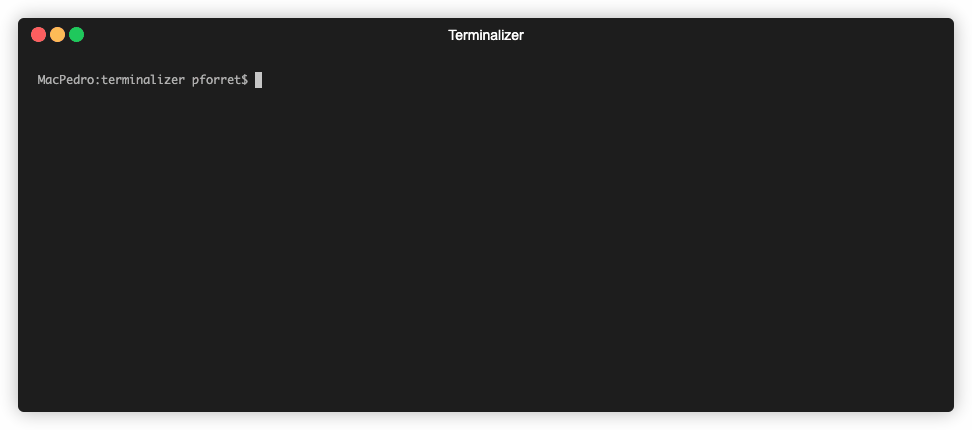

[](https://basher.gitparade.com/package/)


# pforret/progressbar


Show a CLI progress bar for long running scripts

## Installation

with [basher](https://github.com/basherpm/basher)

	$ basher install pforret/progressbar

or with `git`

```bash
$ git clone https://github.com/pforret/progressbar.git
$ cd progressbar
$ sudo ln -s $(pwd)/progressbar /usr/local/bin/ # or someone else in your path
```

## Usage

    Program: progressbar 1.1.0 by peter@forret.com
    Updated: Dec  1 14:39:22 2020
    Usage: progressbar [-h] [-q] [-v] [-f] [-l <log_dir>] [-t <tmp_dir>] [-b <bar>] [-c <char>] <action> <input>
    Flags, options and parameters:
        -h|--help      : [flag] show usage [default: off]
        -q|--quiet     : [flag] no output [default: off]
        -v|--verbose   : [flag] output more [default: off]
        -f|--force     : [flag] do not ask for confirmation (always yes) [default: off]
        -l|--log_dir <val>: [optn] folder for log files   [default: log]
        -t|--tmp_dir <val>: [optn] folder for temp files  [default: /tmp/progressbar]
        -b|--bar <val>: [optn] format of bar: normal/half/long/short  [default: normal]
        -c|--char <val>: [optn] character to use a filler  [default: #]
        <action>  : [parameter] lines/seconds/clear/check
        <input>   : [parameter] input number or operation identifier     
                
## Examples



### Simple use: # lines or seconds is known
```bash
# when the approx number of lines output is known
# e.g. first do a rsync --dry-run to check how many files have to be trasferred
# and then use this number in the actual operation
$ expected_lines=$(rsync --dry-run <from> <to> | awk 'END {print NR}')
$ rsync <from> <to> | progressbar lines "$expected_lines"

# similarly: when the approx number of seconds is known
$ <do_something_for_1_hour> | progressbar seconds 3600
```

### Auto-estimate lines/seconds
```bash
# the first time the script learns the expected # lines/seconds for operation '40-pings-to-google'
$ ping -c 40 www.google.com | progressbar lines 40-pings-to-google
45 lines / 39 secs …

# the following times, it can use this information to show a 0-100% progressbar
$ ping -c 40 www.google.com | progressbar lines 40-pings-to-google
[############################--3---------4---------5---------6---------7---------8---------9--------] 28% / 11 secs … 

# can also be used with different progress bar format (here: short)
$ ping -c 40 www.google.com | progressbar -b short lines 40-pings-to-google
[##-------] 28% / 11 secs … 

# use '|' as character for 'done' time
$ ping -c 40 www.google.com | progressbar -c '|' lines 40-pings-to-google
[|||||||||||||||||||||||||||||||||||-----4---------5---------6---------7---------8---------9--------] 35% / 14 secs … 


# for instance, to use it with rsync, first do a --dry-run (rather fast) to get the estimated # of lines
$ rsync --dry-run -avz source/ destination/ | progressbar lines long-rsync-operation

# and then run the actual operation, which will take much longer, but will output +- the same # of lines
$ rsync -avz source/ destination/ | progressbar lines long-rsync-operation

```
   
    
## Acknowledgements

* script created with [bashew](https://github.com/pforret/bashew)

&copy; 2020 Peter Forret
